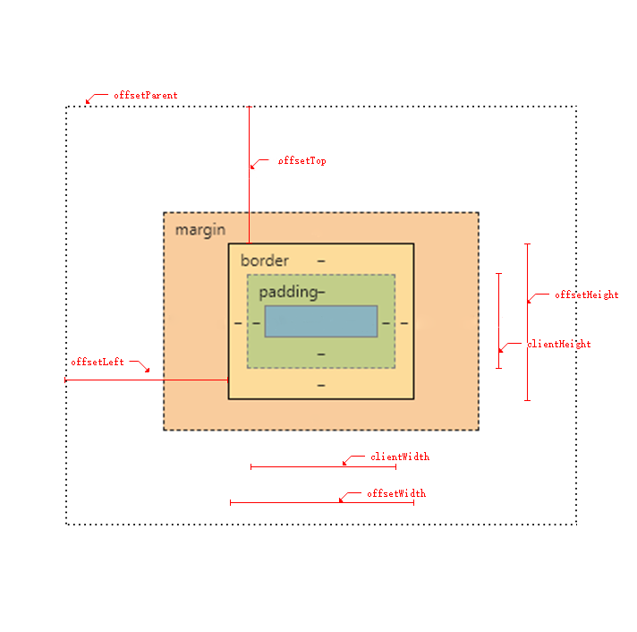

# DOM
## 浏览器渲染原理（webkit）

### 渲染树
#### DOM
浏览器接收到HTML文件并转换为DOM树
::: warning 注意
DOM属于渲染引擎，JS属于JS引擎，当我们通过JS操作DOM时，其中涉及到两个线程之间的通信，必定会带来一些性能上的损耗，操作DOM可能会带来重绘回流的情况

:::
#### CSSOM
浏览器接收到CSS文件并转换为CSSOM树，这个过程是**很耗资源**的。由于样式可以自行设置给某个节点，也可以通过[继承]()获得，浏览器递归CSSOM树，确定具体的元素具体样式。

::: warning 注意
尽可能避免写过具体的css选择器（减少css层级），对于HTML尽量少的添加无意义的标签，保证**层级扁平**
:::
#### render tree

::: tip 提示
在DOM树与CSSOM树合并过程中，display:none属性不会再渲染树中显示，形成渲染树后浏览器根据渲染树进行布局（回流），然后调用GPU绘制，合成图层，最后输出在屏幕上
:::
### 重绘与回流
#### 回流
会导致回流的操作
- 页面首次渲染
- 浏览器窗口大小发生改变
- 元素尺寸或者位置改变
- 元素内容变化（文字或者图片大小等等）
- 元素字体大小变化
- 添加或者删除可见的DOM元素
- 激活css伪类（例如：hover）
- 查询某些属性或调用某些方法

会导致回流的常用属性与方法
- clientWidth、clientHeight、clientTop、clientLeft
- offsetWidth、offsetHeight、offsetTop、offsetLeft
- scrollWidth、scrollHeight、scrollTop、scrollLeft
- scrollIntoView()、scrollIntoViewIfNeeded()
- getComputedStyle()
- getBoundingClientRect()
- scrollTo()
::: tip 提示
因为列队中可能会有影响这些属性或方法返回值的操作，即使获取的信息与列队中的操作引发的改变无关，浏览器也会强行清空列队来确保获取到最精确的值
:::

#### 重绘
当元素样式的改变不影响他在文档流中的位置时（如color，visibility等），浏览器会将新样式赋予元素并重绘它
### 性能优化
- 回流会`必定`会引起重绘，重绘`不一定`会引发回流，回流成本比重绘高很多，改变父节点里的子节点很可能会导致父节点的一系列回流
- 不要使用`table`布局，可能很小的改动会导致整改table的重新布局
- 动画实现的速度的选择，动画速度越快，回流次数越多，也可以选择使用`requestAnimationFrame`
- css选择符从`从右往左`匹配查询，避免节点层数级过多
- 尽可能在`DOM`树的最末端改变`class`
- 使用`transform`代替`top`
- 使用`visibility`替换`display:none`，因为前者只会引起重绘，后者会引起回流

- 避免频繁读取会引起回流的属性或引起会导致回流的方法，如果需要多次使用，可以用变量存储
- 对具有复杂动画的元素使用position或者field，使它脱离文档流（脱离文档流后不会影响其他元素），否则会引起父元素及后继元素频繁回流
- 避免使用css表达式（例：calc()）
- 不要把节点属性值放在一个循环里当成循环里的变量
```js
for(let i=0;i<1000;i++){
  //获取offsetTop会导致回流
  console.log(document.querySelector('.testClass').style.offsetTop)
}
```
- 将频繁重绘或者回流的节点设置为图层，图层能够阻止该节点的渲染行为影响别的节点。例如video标签，浏览器会自动将该节点变为图层

设置节点为图层的常用方法：
>- will-change
>- video、iframe标签

#### 例子：插入几万个DOM，实现页面不卡顿
思路：可以分批渲染
1. 虚拟滚动（进入可视区后才进行DOM渲染）
2. 通过requestAnimationFrame的方式去循环插入DOM
3. 分时函数

## 元素偏移量与客户区大小
### 元素偏移量
元素可见大小由：高度、宽度、内边距、滚动条、边框大小
- offsetHeight：垂直方向上占用的空间大小，`高度+水平滚动条的宽度（可见的）+上下边框高度`
- offsetWidth：水平方向上占用的空间大小，`宽度+垂直滚动条的宽度+左右边框宽度`
- offsetTop：元素的`上外边框`到包含元素的`上内边框`之间的距离
- offsetLeft：元素的`左外边框`到包含元素的`左内边框`之间的距离

::: warning 注意
1.以上大小不包括外边距  
2.offsetParent属性不一定与parentNode的值相等，例如`td`元素的`offsetParent`是作为其祖父元素的`table`元素，因为table是在DOM层次中距离td最近的一个`具有大小的元素`
:::
### 客户端大小
指的是元素内容及其内边距所占据的空间大小
- clientWidth：元素内容区宽度加上左右内边距宽度
- clientHeight：元素内容区高度加上上下内边距高度
::: warning 注意
客户区大小就是元素内部的空间大小，因此滚动条占用的空间不计算在内
:::

### 获取元素的偏移量
```js
// 获取左偏移量
function getElementLeft(element){
    var actualLeft = element.offsetLeft;
    var current = element.offsetParent;
    while (current !== null){
        actualLeft += current.offsetLeft;
        current = current.offsetParent;
    }
    return actualLeft;
}
// 获取上偏移量
function getElementTop(element){
    var actualTop = element.offsetTop;
    var current = element.offsetParent;
    while (current !== null){
        actualTop += current. offsetTop;
        current = current.offsetParent;
    }
    return actualTop;
}
```
::: warning 注意
1.对于一般布局利用这两个函数利用offsetParent属性在DOM层次中逐级向上回溯，将每层次中的偏移量属性值合并到一块，可以得到非常精确的结果。但是对于`表格和内嵌框架布局`的页面，不同浏览器实现这些元素的方式不同，取得的值就不太精确了   
2.读取偏移量会导致DOM回流，如需重复使用其中的某些属性的值，可以将他们保存在局部变量中，来提高性能
:::

### 读取浏览器视口大小
```js
function getViewport(){

   var pageWidth = window.innerWidth,
    pageHeight = window.innerHeight;

    if (typeof pageWidth != "number") {
    if (document.compatMode == "CSS1Compat") {
      return {
        pageWidth: document.documentElement.clientWidth,
        pageHeight: document.documentElement.clientHeight
      };
    } else {
      return {
        pageWidth: document.body.clientWidth,
        pageHeight: document.body.clientHeight
      };
    }
  } else {
    return {
      pageWidth,
      pageHeight
    };
  }
}

```

## 滚动大小
- scrollHeight:没有滚动条的情况下，元素内容的总高度
- scrollWidth:没有滚动条的情况下，元素内容的总宽度
- scrollTop:被隐藏在内容区域上方的像素数。通过设置这个属性可以改变元素的滚动位置
- scrollLeft:被隐藏在内容区域左方的像素数。通过设置这个属性可以改变元素的滚动位置


::: tip
scrollWidth 和 scrollHeight 主要用于确定元素内容的实际大小

scrollLeft 和 scrollTop 设置为 0，就可以重置元素的滚动位置
:::
### 获取文档尺寸
```js
// 确定文档的总大小
var docHeight = Math.max(document.documentElement.scrollHeight,
document.documentElement.clientHeight);
var docWidth = Math.max(document.documentElement.scrollWidth,
document.documentElement.clientWidth);
```
### 回滚顶部
```js
function scrollToTop(element){
    if (element.scrollTop != 0){
        element.scrollTop = 0;
    }
}
```

## 确定元素大小
`getBoundingClientRect()` 方法包含 4 个属性： `left` 、 `top` 、 `right` 和 `bottom` 。这些属性给出了元素在页面中相对于视口的位置。IE8 及更早版本认为文档的左上角坐标是(2, 2)，而其他浏览器包括 IE9 则将传统的(0,0)作为起点坐标   
一般来说， `right` 和 `left` 的差值与 `offsetWidth` 的值相等，而 `bottom` 和 `top` 的差值与 `offsetHeight`相等。而且，`left` 和 `top` 属性大致等于 `getElementLeft()` 和 `getElementTop()` 函数取的值
```js
function getBoundingClientRect(element){

    var scrollTop = document.documentElement.scrollTop;
    var scrollLeft = document.documentElement.scrollLeft;

    if (element.getBoundingClientRect){

        if (typeof arguments.callee.offset != "number"){

            var temp = document.createElement("div");
            temp.style.cssText = "position:absolute;left:0;top:0;";
            document.body.appendChild(temp);
            arguments.callee.offset = -temp.getBoundingClientRect().top - scrollTop;
            document.body.removeChild(temp);
            temp = null;
        }

        var rect = element.getBoundingClientRect();
        var offset = arguments.callee.offset;

        return {
            left: rect.left + offset,
            right: rect.right + offset,
            top: rect.top + offset,
            bottom: rect.bottom + offset
        };
    } else {

        var actualLeft = getElementLeft(element);
        var actualTop = getElementTop(element);

        return {
            left: actualLeft - scrollLeft,
            right: actualLeft + element.offsetWidth - scrollLeft,
            top: actualTop - scrollTop,
            bottom: actualTop + element.offsetHeight - scrollTop
        }
    }
}
```
这个函数返回的值可能会有所不同，例如使用表格布局或使用滚
动元素的情况下。
::: warning 注意
由于这里使用了 arguments.callee ，所以这个方法不能在严格模式下使用。
:::


## SVGA WEB端示例
[SVGA](http://svga.io/intro.html) 是一种跨平台的开源动画格式，同时兼容 iOS / Android / Web。SVGA 除了使用简单，性能卓越，同时让动画开发分工明确，各自专注各自的领域，大大减少动画交互的沟通成本，提升开发效率。动画设计师专注动画设计，通过工具输出svga动画文件，提供给开发工程师在集成 svga player 之后直接使用。动画开发从未如此简单！

```html
<div id="demoCanvas" style="width: 300px;height: 300px;margin: 0 auto"></div>
<script src="https://cdn.jsdelivr.net/npm/svgaplayerweb@2.3.0/build/svga.min.js"></script>
<script>
    var player = new SVGA.Player('#demoCanvas');
    var parser = new SVGA.Parser('#demoCanvas'); // Must Provide same selector eg:#demoCanvas IF support IE6+
    parser.load('./loading.svga', function (videoItem) {
        player.setVideoItem(videoItem);
        player.startAnimation();
    })
</script>
```


## DOM事件类
### DOM事件的级别
1. DOM0 element.onclick = function(){}<br>
2. DOM2 element.addEventListener("click",function(){},false)<br>
3. DOM3 element.addEventListener("keyup",function(){},false)
### DOM事件模型
捕获：从上到下<br>
冒泡：从下到上
### DOM事件流
window对象=>捕获=>目标阶段=>冒泡=>window对象
### DOM事件捕获的具体流程
window=>document=>html(document.documentElement)=>body=>...=>目标元素
### 事件绑定
element.addEventListener("click",function(){},false)（最后一个参数false表示冒泡阶段触发，true表示捕获阶段触发）
```html
<body>
    <div id="ev">
        目标元素
    </div>
    <script>
        var ev = document.getElementById('ev');
        /********************捕获阶段触发***************************/
        window.addEventListener('click',function(){
            console.log('window captrue')
        },true);
        document.addEventListener('click',function(){
            console.log('document captrue')
        },true);
     
        document.documentElement.addEventListener('click',function(){
            console.log('html captrue')
        },true);
        document.body.addEventListener('click',function(){
            console.log('body captrue')
        },true);
        ev.addEventListener('click',function(){
            console.log('ev captrue')
        },true);
        /******************冒泡阶段触发**********************/
        window.addEventListener('click',function(){
            console.log('window captrue')
        }, false);
        document.addEventListener('click',function(){
            console.log('document captrue')
        }, false);
     
        document.documentElement.addEventListener('click',function(){
            console.log('html captrue')
        }, false);
        document.body.addEventListener('click',function(){
            console.log('body captrue')
        }, false);
        ev.addEventListener('click',function(){
            console.log('ev captrue')
        }, false);
        
    </script>
</body>
```
触发顺序：<br>
window captrue <br>
document captrue<br>
html captrue<br>
body captrue<br>
ev captrue<br>
ev captrue<br>
body captrue<br>
html captrue<br>
document captrue<br>
window captrue
### Event对象的常见应用
1. event.preventDefault()（阻止默认行为）<br>
2. event.stopPropagation()（阻止冒泡）<br>
3. event.stoplmmediatePropagation()（事件响应优先级，在优先级高的事件中加入该函数，可以阻止优先级低的函数执行）<br>
4. event.currentTarget（当前所绑定的事件）<br>
5. event.target（当前被点击的元素）
### 自定义事件
```js
var eve = new Event('custome');
ev.addEventListener('custome',function(){console.log('custome')});
ev.dispatchEvent(eve);
```
customEvent与Event都可以创建自定义事件，customEvent可以加数据


## 盒模型
### 标准盒模型+IE盒模型
盒模型：content+padding+border+margin
### 标准盒模型和IE盒模型区别
标准width/height计算只包括content<br>
IE的width/height计算包括content+padding+border
### 设置盒模型
标准：box-sizing:content-box;<br>
IE：box-sizing:border-box;
### js取得盒模型的宽高
1.dom.style.width/height（只适合内联元素的宽高）<br>
2.dom.currentStyle.width/height（获取渲染后的宽高，仅IE）<br>
3.window.getComputedStyle(dom).width/height（兼容性比2的更好）<br>
4.dom.getBoundingClientRect.width/height（计算绝对位置，获得四个元素top/left/width/height）
### 盒模型边距重叠问题（重叠原则是取最大值）
#### 解决方法：BFC（块级元素格式化上下文）
BFC原理：<br>
1.BFC元素垂直方向会有外边距重叠<br>
2.BFC不与浮动元素重叠（清浮动重要原理）<br>
3.BFC是独立容器，不影响其他元素也不受其他元素影响<br>
4.BFC子元素即使是浮动元素也会参加计算<br>
5.BFC计算高度时，浮动元素也会参与计算
#### 创建BFC(受BFC原理2影响，BFC可以清浮动)
1.overflow:auto/hidden<br>
2.float:left/right<br>
3.position:absolute/fixed

